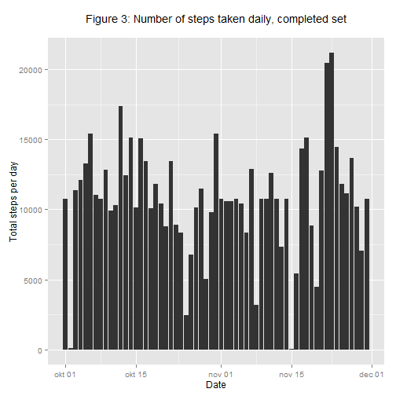
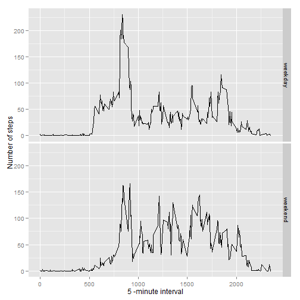

# Reproducible Research: Peer Assessment 1

---------
## Loading and preprocessing the data
Read in data from the file activity.csv using the read.csv-function

```r
AcitvityData<- read.csv("activity.csv", header=TRUE, sep=",")
```

Format the date.

```r
AcitvityData$date <- as.Date(AcitvityData$date)
```

Load librarys for later use

```r
library(plyr)
library(ggplot2)
```

## What is mean total number of steps taken per day?


```r
    daytotal <- ddply(AcitvityData, "date", summarise, Mean = mean(steps, na.rm = TRUE), 
                 Median = median(steps), sum = sum(steps))

mean_steps <- round(mean(daytotal$sum, na.rm = TRUE), 0) 
median_steps <- round(median(daytotal$sum, na.rm = TRUE), 0)
```
The subject took a mean of 10766 and a median of 10765 steps per day


Histogram of total number of steps each day?

```r
histogram <- 
      qplot(x=date, y=steps,
            data=subset(AcitvityData, complete.cases(AcitvityData)),
            stat='summary', fun.y=sum, geom='bar') +
      labs(title='Figure 1: Number of steps taken daily\n',
           y='Total steps per day', x='Date')
plot(histogram)
```

 

## What is the daily activity pattern?
Plot daily activity based on mean steps per interval

```r
intervaltotal <- ddply(AcitvityData, "interval", summarise, Mean = mean(steps, na.rm = TRUE))

qplot(x=intervaltotal$interval, y=intervaltotal$Mean, xlab="Interval", ylab="Mean Steps", geom="line", main="Figure 2: Mean number of steps per interval")
```

 

On average across all the days in the dataset, the 5-minute interval contains the maximum number of steps?

```r
# which 5-minute interval contains the maximum number of steps
 Smax = intervaltotal[ (which.max(intervaltotal$Mean)), 1]
```
The 835 interval contains the maximum number of steps

## Imputing missing values
Total number of missing values

```r
totalMissingValues <- sum(!complete.cases(AcitvityData))
```
The total number of missing values is 2304.

### Strategy for filling missing values 
If a values is missing, the mean for that interval is used 
to fill the data set.


```r
fullInterval <- do.call(rbind, replicate(((nrow(AcitvityData))/nrow(intervaltotal)), 
                  intervaltotal, simplify=FALSE))

AcitvityDataComplete <- AcitvityData

for (i in 1:(nrow(AcitvityDataComplete)) ) {
      if (is.na(AcitvityDataComplete[i,1])) {
            AcitvityDataComplete[i,1] = fullInterval[i,2]
      }
}

# Histogram for completed set 
histogram <- 
      qplot(x=date, y=steps,
            data=subset(AcitvityDataComplete, complete.cases(AcitvityDataComplete)),
            stat='summary', fun.y=sum, geom='bar') +
      labs(title='Figure 3: Number of steps taken daily, completed set\n',
           y='Total steps per day', x='Date')
plot(histogram)
```

 


```r
daytotalComp <- ddply(AcitvityDataComplete, "date", summarise, Mean = mean(steps, na.rm = TRUE), 
             Median = median(steps), sum = sum(steps))

mean_steps_Comp <- round(mean(daytotalComp$sum, na.rm = TRUE), 0) 
median_steps_Comp <- round(median(daytotalComp$sum, na.rm = TRUE), 0)
```
After filling in missing values the mean number of steps is 10766, the median is 10766.
 


## Are there differences in activity patterns between weekdays and weekends?
A panel plot is used to display the difference between the activity pattern between weekdays and weekends

```r
weekdays <- as.POSIXlt(AcitvityDataComplete$date)$wday
AcitvityDataComplete <- cbind(AcitvityDataComplete, weekdays)
AcitvityDataComplete$weekday <- weekdays


# Add column for weekday to dataset. 
for (i in 1:(nrow(AcitvityDataComplete)) ) {
      if ((AcitvityDataComplete[i,4] == 6) | (AcitvityDataComplete[i,4] == 0)) {
            AcitvityDataComplete[i,5] = "weekend"
      }
      else {AcitvityDataComplete[i,5] = "weekday"}
}


intervaltotalComp <- ddply(AcitvityDataComplete, c("interval","weekday"), 
                           summarise, Mean = mean(steps, na.rm = TRUE))

ggplot(intervaltotalComp, aes(interval, Mean)) + geom_line() + facet_grid(weekday 
                  ~ .)+ xlab("5 -minute interval") + ylab("Number of steps")
```

 

